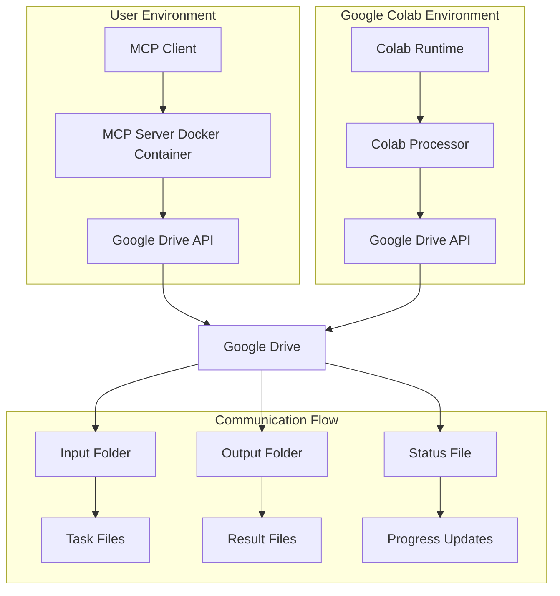

# Google Colab MCP Server Architecture

## Overview

This document outlines the architecture for an MCP (Model Context Protocol) server that facilitates executing resource-heavy calculations in Google Colab. The server provides tools for uploading code/notebooks, running them in Colab, retrieving results, and handling authentication in a non-interactive manner.

## System Architecture



## Component Details

### MCP Server Container

**Base Image:** `node:18-alpine`

**Key Dependencies:**
- `@modelcontextprotocol/sdk`
- `googleapis` (for Drive API)
- `google-auth-library`
- `express` (for potential HTTP endpoints)

**Environment Variables:**
- `GOOGLE_CLIENT_ID`
- `GOOGLE_CLIENT_SECRET`
- `GOOGLE_REFRESH_TOKEN`
- `DRIVE_FOLDER_ID` (JobAgent folder)
- `COLAB_TIMEOUT_MINUTES` (default: 30)

### MCP Tools

#### 1. `upload_code`
**Purpose:** Upload Python code or Jupyter notebook to Colab for execution

**Parameters:**
- `code`: String containing Python code or notebook JSON
- `filename`: Target filename in Colab
- `requirements`: Optional pip requirements

**Implementation:**
- Validates code syntax
- Creates task payload with code and metadata
- Uploads to Google Drive input folder
- Returns upload confirmation with task ID

#### 2. `run_calculation`
**Purpose:** Execute uploaded code in Colab environment

**Parameters:**
- `task_id`: Reference to uploaded code
- `execution_params`: Optional parameters for code execution

**Implementation:**
- Signals Colab processor to start execution
- Monitors progress via status file
- Handles timeout and error conditions
- Returns execution status and result location

#### 3. `get_results`
**Purpose:** Retrieve computation results from Colab

**Parameters:**
- `task_id`: Reference to completed task
- `result_format`: Desired output format (json, text, binary)

**Implementation:**
- Downloads result files from Drive output folder
- Parses and formats results
- Cleans up temporary files
- Returns structured result data

#### 4. `authenticate`
**Purpose:** Set up and validate Google Drive authentication

**Parameters:**
- `setup_mode`: Authentication method (service_account, oauth_refresh, interactive_setup)
- `test_connection`: Boolean to test API connectivity

**Implementation:**
- Validates provided credentials format
- Tests Drive API connectivity and permissions
- Creates/verifies JobAgent folder structure
- Returns authentication status and folder IDs

#### 5. `list_tasks`
**Purpose:** List current and recent tasks

**Parameters:**
- `status_filter`: Optional filter by task status (pending, running, completed, failed)
- `limit`: Maximum number of tasks to return (default: 10)

**Implementation:**
- Scans Drive folders for task files
- Returns structured task list with metadata
- Includes execution status and timestamps

### Colab Processor Integration

**Integration Strategy:**
The MCP server will extend the existing `colab_processor.py` to handle general code execution tasks while maintaining compatibility with existing job search, fit analysis, and course suggestion functionality.

**Enhanced colab_processor.py:**

```python
class ColabProcessor:
    def __init__(self):
        # Existing initialization
        self.task_handlers = {
            # Existing handlers
            'job_search': self.process_job_search,
            'fit_analysis': self.analyze_job_fit,
            'resume_generation': self.generate_resumes,
            'course_suggestions': self.suggest_courses,
            # New MCP handlers
            'code_execution': self.execute_code,
            'notebook_execution': self.execute_notebook,
            'data_processing': self.process_data
        }

    async def execute_code(self, task_data: Dict) -> Dict:
        """Execute arbitrary Python code in Colab for MCP server."""
        code = task_data.get('code', '')
        requirements = task_data.get('requirements', [])
        execution_params = task_data.get('execution_params', {})

        # Install requirements if provided
        if requirements:
            for req in requirements:
                try:
                    os.system(f'pip install {req}')
                except Exception as e:
                    logger.error(f"Failed to install {req}: {e}")

        # Execute code in isolated environment with timeout
        try:
            # Create execution environment
            exec_globals = {'__builtins__': __builtins__}
            exec_locals = {}

            # Add execution parameters to globals
            exec_globals.update(execution_params)

            # Execute with timeout protection
            import signal
            from contextlib import contextmanager

            @contextmanager
            def timeout_context(seconds):
                def timeout_handler(signum, frame):
                    raise TimeoutError("Code execution timed out")

                signal.signal(signal.SIGALRM, timeout_handler)
                signal.alarm(seconds)
                try:
                    yield
                finally:
                    signal.alarm(0)

            with timeout_context(300):  # 5 minute timeout
                exec(code, exec_globals, exec_locals)

            result = exec_locals.get('result', exec_globals.get('result', 'Execution completed'))
            return {
                'status': 'success',
                'result': result,
                'execution_time': time.time() - time.time(),  # Would track actual time
                'output': str(result)
            }
        except TimeoutError:
            return {'status': 'error', 'error': 'Code execution timed out after 5 minutes'}
        except Exception as e:
            return {'status': 'error', 'error': str(e), 'traceback': traceback.format_exc()}

    async def execute_notebook(self, task_data: Dict) -> Dict:
        """Execute Jupyter notebook in Colab."""
        notebook_content = task_data.get('notebook', '')
        parameters = task_data.get('parameters', {})

        try:
            # Parse notebook JSON
            import json
            notebook = json.loads(notebook_content)

            # Execute cells sequentially
            results = []
            for cell in notebook.get('cells', []):
                if cell.get('cell_type') == 'code':
                    code = ''.join(cell.get('source', []))
                    # Execute code (simplified - would need full notebook execution)
                    cell_result = await self.execute_code({
                        'code': code,
                        'execution_params': parameters
                    })
                    results.append(cell_result)

            return {
                'status': 'success',
                'results': results,
                'cell_count': len(results)
            }
        except Exception as e:
            return {'status': 'error', 'error': f'Notebook execution failed: {str(e)}'}

    async def process_data(self, task_data: Dict) -> Dict:
        """Process data files in Colab."""
        # Implementation for data processing tasks
        data_files = task_data.get('data_files', [])
        processing_code = task_data.get('processing_code', '')

        # Download data files from Drive
        # Execute processing code
        # Upload results back to Drive

        return {'status': 'success', 'message': 'Data processing completed'}
```

### Docker Configuration

**Dockerfile:**
```dockerfile
FROM node:18-alpine

# Install system dependencies
RUN apk add --no-cache python3 py3-pip

# Create app directory
WORKDIR /app

# Copy package files
COPY package*.json ./

# Install dependencies
RUN npm ci --only=production

# Copy server code
COPY src/ ./src/

# Create non-root user
RUN addgroup -g 1001 -S nodejs && \
    adduser -S mcp -u 1001

USER mcp

# Expose port for HTTP mode (optional)
EXPOSE 3000

# Health check
HEALTHCHECK --interval=30s --timeout=10s --start-period=5s --retries=3 \
    CMD node healthcheck.js

# Run MCP server
CMD ["node", "src/index.js"]
```

**docker-compose.yml integration:**
```yaml
services:
  colab-mcp-server:
    build:
      context: .
      dockerfile: docker/colab-mcp-server/Dockerfile
    container_name: job_agent_colab_mcp
    restart: unless-stopped
    environment:
      - GOOGLE_CLIENT_ID=${GOOGLE_CLIENT_ID}
      - GOOGLE_CLIENT_SECRET=${GOOGLE_CLIENT_SECRET}
      - GOOGLE_REFRESH_TOKEN=${GOOGLE_REFRESH_TOKEN}
      - DRIVE_FOLDER_ID=${DRIVE_FOLDER_ID}
      - COLAB_TIMEOUT_MINUTES=30
    volumes:
      - colab_temp:/tmp/colab
    networks:
      - job_agent_network
    depends_on:
      - mongodb
```

### MCP Configuration

**MCP Settings Configuration:**
Add the following to your MCP settings file (`/home/codespace/.vscode-remote/data/User/globalStorage/kilocode.kilo-code/settings/mcp_settings.json`):

```json
{
  "mcpServers": {
    "colab-compute": {
      "command": "docker",
      "args": ["exec", "job_agent_colab_mcp", "node", "/app/src/index.js"],
      "env": {
        "GOOGLE_CLIENT_ID": "your-client-id",
        "GOOGLE_CLIENT_SECRET": "your-client-secret",
        "GOOGLE_REFRESH_TOKEN": "your-refresh-token",
        "DRIVE_FOLDER_ID": "your-drive-folder-id",
        "COLAB_TIMEOUT_MINUTES": "30"
      },
      "disabled": false,
      "alwaysAllow": ["upload_code", "run_calculation", "get_results"],
      "disabledTools": []
    }
  }
}
```

**Alternative Local Configuration:**
For development or local deployment:

```json
{
  "mcpServers": {
    "colab-compute": {
      "command": "node",
      "args": ["/path/to/colab-mcp-server/build/index.js"],
      "env": {
        "GOOGLE_CLIENT_ID": "your-client-id",
        "GOOGLE_CLIENT_SECRET": "your-client-secret",
        "GOOGLE_REFRESH_TOKEN": "your-refresh-token",
        "DRIVE_FOLDER_ID": "your-drive-folder-id"
      }
    }
  }
}
```

### Security Considerations

#### Authentication & Authorization
- **OAuth 2.0 Refresh Tokens:** Stored as environment variables, never in code
- **Service Account Option:** For fully automated deployments
- **Token Rotation:** Implement automatic refresh token updates
- **Access Scoping:** Limit Drive API to specific folder only

#### Data Protection
- **Encryption in Transit:** All Drive API calls use HTTPS
- **Data Sanitization:** Validate and sanitize all code inputs
- **Resource Limits:** Implement execution time and memory limits
- **Audit Logging:** Log all operations for security monitoring

#### Container Security
- **Non-root User:** Run MCP server as non-privileged user
- **Minimal Base Image:** Use Alpine Linux for smaller attack surface
- **Dependency Scanning:** Regular security scans of Node.js dependencies
- **Secret Management:** Use Docker secrets or external secret managers

### Data Handling

#### Input Processing
- **Code Validation:** Syntax checking before upload
- **Size Limits:** Maximum code size restrictions
- **Format Support:** Python scripts, Jupyter notebooks, data files
- **Metadata Extraction:** Extract requirements and dependencies

#### Result Management
- **Structured Output:** Consistent result format across all tools
- **Large File Handling:** Support for binary and large text outputs
- **Caching:** Optional result caching for repeated executions
- **Cleanup:** Automatic cleanup of temporary files and old results

#### Error Handling
- **Graceful Degradation:** Continue operation despite individual failures
- **Detailed Error Messages:** Provide actionable error information
- **Retry Logic:** Implement exponential backoff for transient failures
- **Timeout Management:** Configurable timeouts for long-running tasks

### Performance Optimization

#### Execution Optimization
- **Parallel Processing:** Support multiple concurrent executions
- **Resource Pooling:** Reuse Colab runtimes when possible
- **Batch Processing:** Group related tasks for efficiency
- **Caching Strategy:** Cache frequently used dependencies

#### Monitoring & Metrics
- **Execution Metrics:** Track execution time, success rates, resource usage
- **Health Checks:** Monitor Colab connectivity and Drive API status
- **Alerting:** Notify on failures or performance degradation
- **Logging:** Structured logging for debugging and analysis

### Deployment Strategy

#### Development Environment
- **Local Testing:** Mock Colab environment for development
- **Unit Tests:** Comprehensive test coverage for all tools
- **Integration Tests:** End-to-end testing with actual Colab

#### Production Deployment
- **Container Orchestration:** Kubernetes or Docker Swarm
- **Load Balancing:** Distribute requests across multiple instances
- **Backup & Recovery:** Regular backups of configuration and data
- **Rolling Updates:** Zero-downtime deployment strategy

### Integration with Existing System

#### Compatibility
- **API Consistency:** Match existing Colab integration patterns
- **Data Formats:** Use existing data structures and schemas
- **Error Handling:** Consistent error reporting across services

#### Extension Points
- **Plugin Architecture:** Allow custom task handlers
- **Event System:** Emit events for integration with other services
- **Configuration:** External configuration for different environments

This architecture provides a robust, secure, and scalable solution for executing resource-intensive calculations in Google Colab through an MCP server interface, seamlessly integrating with the existing job application agent ecosystem.